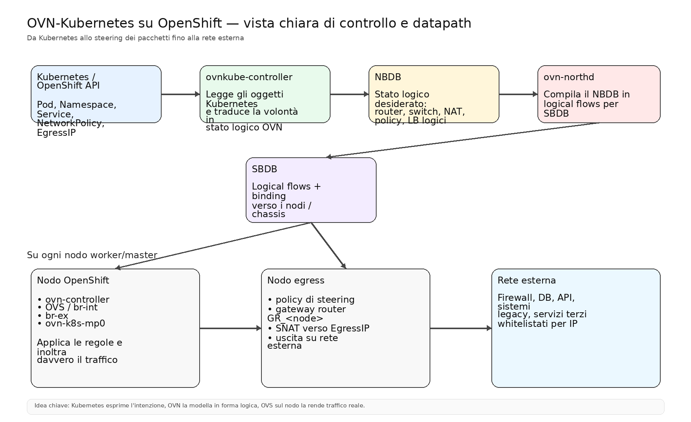
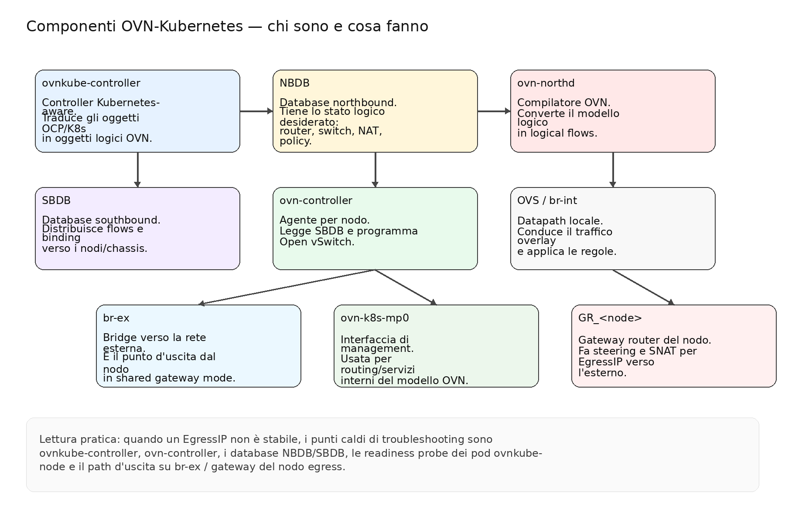
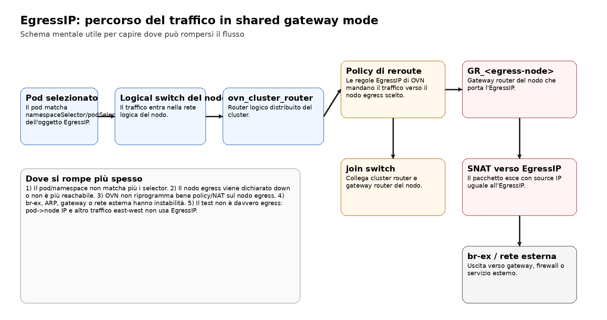
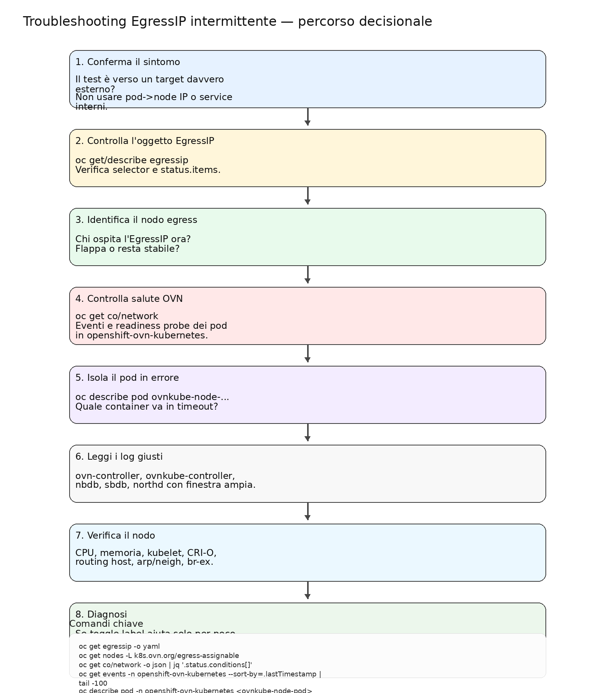

# OVN-Kubernetes + EgressIP su OpenShift
**Guida completa in un unico README**  
Lingua: italiano

> Obiettivo: avere in un solo repo una spiegazione chiara di OVN-Kubernetes, dei suoi componenti, del flusso EgressIP e di un percorso pratico di troubleshooting per problemi intermittenti su OpenShift.

## Contenuto del repo

- `README.md` — guida completa “master”, con immagini e comandi
- `images/` — diagrammi inclusi nel README
- `scripts/collect-ovn-egressip-diagnostics.sh` — raccolta read-only dei dati diagnostici

---

# 1) Cos'è OVN-Kubernetes

OVN-Kubernetes è il plugin di rete predefinito di OpenShift.

In pratica:
- Kubernetes / OpenShift descrive **cosa vuoi ottenere**;
- OVN costruisce un **modello logico di rete**;
- Open vSwitch (OVS) sul nodo applica quel modello al traffico reale.

Detta in modo semplice:

> Kubernetes esprime l'intenzione.  
> OVN costruisce la rete logica.  
> OVS inoltra davvero i pacchetti.

---

# 2) Vista generale



## Lettura del diagramma
1. Gli oggetti Kubernetes (Pod, Namespace, Service, EgressIP, NetworkPolicy) vengono osservati dai controller OVN.
2. Il controller aggiorna il **NBDB** con lo stato logico desiderato.
3. **ovn-northd** compila quel modello in logical flows nel **SBDB**.
4. Ogni **ovn-controller** sui nodi legge il SBDB e programma **OVS**.
5. Il traffico esce tramite `br-ex` verso la rete esterna.
6. Se è coinvolto un EgressIP, il traffico viene steering verso il nodo egress e lì subisce SNAT.

---

# 3) Componenti OVN-Kubernetes: chi sono e cosa fanno



## 3.1 Kubernetes / OpenShift API
Contiene gli oggetti sorgente:
- Pod
- Namespace
- Service
- NetworkPolicy
- EgressIP
- EgressFirewall
- EgressQoS

È il punto da cui parte tutto.

## 3.2 ovnkube-controller
È il controller che osserva gli oggetti Kubernetes e costruisce il modello di rete logico richiesto.

In pratica:
- legge le CR e gli oggetti standard;
- aggiorna la rete logica OVN;
- gestisce riconciliazioni quando cambiano label, pod, namespace o stato dei nodi.

## 3.3 NBDB (Northbound Database)
È il database dello **stato logico desiderato**.

Qui trovi oggetti come:
- logical switches
- logical routers
- NAT
- policy di routing
- load balancer logici

## 3.4 ovn-northd
È il “compilatore” di OVN:
- prende gli oggetti logici del NBDB;
- li converte in logical flows adatti al SBDB.

## 3.5 SBDB (Southbound Database)
Contiene:
- logical flows
- binding verso nodi / chassis
- informazioni utili agli agenti per nodo

## 3.6 ovn-controller
Gira su ogni nodo.
Legge il SBDB e programma Open vSwitch con le regole necessarie.

## 3.7 Open vSwitch (OVS)
È il datapath reale.
I bridge più importanti che vedi spesso sono:
- `br-int` — bridge interno
- `br-ex` — bridge verso la rete esterna

## 3.8 br-ex
È il ponte verso la rete fisica esterna.
Quando usi EgressIP in shared gateway mode, l'uscita verso la rete esterna passa di qui.

## 3.9 ovn-k8s-mp0
È l'interfaccia di management usata da OVN-Kubernetes per routing e comunicazioni interne al modello di rete.

## 3.10 ovn_cluster_router, join switch e GR_<node>
Sono i mattoni logici principali del percorso:
- `ovn_cluster_router` = router logico distribuito del cluster
- `join switch` = collega router distribuito e gateway router
- `GR_<node>` = gateway router del singolo nodo

Visione mentale semplice:

```text
Pod -> Logical switch -> ovn_cluster_router -> join switch -> GR_<node> -> br-ex -> rete esterna
```

---

# 4) Cos'è EgressIP

EgressIP serve a far uscire il traffico di uno o più pod verso servizi **esterni al cluster** usando un **source IP costante**.

## Quando si usa
- firewall esterni con whitelist IP
- database esterni che accettano connessioni solo da IP noti
- sistemi legacy che pretendono un IP di origine stabile

## Cose importanti da ricordare
- vale per traffico verso l'esterno del cluster;
- non è il meccanismo giusto per traffico east-west;
- `pod -> node IP` non è un buon test di EgressIP;
- conviene sempre testare verso un target davvero esterno.

---

# 5) Flusso EgressIP



## Lettura pratica del flusso
1. Il pod viene selezionato da `namespaceSelector` e, se presente, da `podSelector`.
2. OVN applica una policy logica che steering il traffico verso il nodo egress.
3. Sul nodo egress il traffico passa nel gateway router logico del nodo.
4. Lì avviene lo **SNAT** verso l'EgressIP.
5. Il traffico esce da `br-ex` verso la rete esterna.

---

# 6) Perché togliere e rimettere la label sembra risolvere

Se togli/rimetti una label su namespace o pod, in genere forzi:
- rivalutazione dei selector dell'oggetto `EgressIP`;
- nuova riconciliazione del controller;
- eventuale riprogrammazione di policy / NAT / assegnazioni.

Quindi:

> il toggle della label può far “ripartire” temporaneamente il traffico,  
> ma spesso non rimuove la vera causa.

Se il problema poi torna, la causa è spesso a monte:
- nodo egress che flappa;
- readiness probe OVN in timeout;
- riconnessioni ai database OVN;
- instabilità del nodo;
- problemi sul path di uscita.

---

# 7) Caso tipico: EgressIP intermittente

Sintomo classico:
- un namespace con EgressIP smette di uscire correttamente;
- togliendo/rimettendo la label torna a funzionare;
- dopo un po' ricade.

## Ipotesi più probabili
1. selector che vengono rivalutati e sbloccano solo temporaneamente;
2. nodo egress non considerato stabile / reachability ballerina;
3. `ovnkube-node` con readiness probe in timeout;
4. problemi di `ovn-controller`, `nbdb`, `sbdb` o `northd`;
5. problemi lato `br-ex`, ARP, gateway o rete esterna;
6. test-case non rappresentativo.

---

# 8) Troubleshooting: percorso consigliato



## 8.1 Fotografia iniziale

```bash
oc get egressip -o yaml
oc describe egressip <NOME_EGRESSIP>
oc get nodes -L k8s.ovn.org/egress-assignable
oc get network.operator cluster -o yaml
```

### Cosa guardare
- `status.items`
- nodo assegnato all'EgressIP
- selector di namespace/pod
- eventuali cambi frequenti di assegnazione

---

## 8.2 Salute del network operator e dei pod OVN

```bash
oc get co/network -o json | jq '.status.conditions[]'
oc get pods -n openshift-ovn-kubernetes -o wide
oc get events -n openshift-ovn-kubernetes --sort-by=.lastTimestamp | tail -100
```

### Segnali forti
- `Readiness probe failed: command timed out`
- restart dei container nei pod `ovnkube-node`
- oscillazioni o errori ripetuti su più nodi

Se vedi questi segnali, il problema è spesso **OVN / nodo / reachability**, non la CR `EgressIP` in sé.

---

## 8.3 Isolare il pod `ovnkube-node` che fallisce

```bash
oc describe pod -n openshift-ovn-kubernetes <ovnkube-node-pod>
oc get pod -n openshift-ovn-kubernetes <ovnkube-node-pod> -o json | jq '.status.containerStatuses[]'
```

### Container da guardare con attenzione
- `ovn-controller`
- `ovnkube-controller`
- `nbdb`
- `sbdb`
- `northd`

---

## 8.4 Log giusti, finestra giusta

```bash
oc logs -n openshift-ovn-kubernetes <pod> -c ovn-controller --since=4h
oc logs -n openshift-ovn-kubernetes <pod> -c ovnkube-controller --since=4h
oc logs -n openshift-ovn-kubernetes <pod> -c nbdb --since=4h
oc logs -n openshift-ovn-kubernetes <pod> -c sbdb --since=4h
oc logs -n openshift-ovn-kubernetes <pod> -c northd --since=4h
```

Filtri utili:

```bash
egrep -i 'timeout|probe|reconnect|northbound|southbound|db|leader|raft|egress|assign|reassign|unreach|health'
```

---

## 8.5 Test corretto dell'EgressIP

Da un pod selezionato, prova verso un target davvero esterno:

```bash
oc exec -n <namespace> <pod> -- curl -s https://ifconfig.me
```

oppure verso un endpoint esterno controllato da te.

### Evita come test principale
- node IP
- service interno
- route interna
- qualsiasi traffico east-west

---

## 8.6 Verifica del nodo egress

```bash
oc debug node/<node> -- chroot /host ip addr
oc debug node/<node> -- chroot /host ip route
oc debug node/<node> -- chroot /host ip rule
oc debug node/<node> -- chroot /host ip neigh
oc debug node/<node> -- chroot /host journalctl -u kubelet --since "4 hours ago"
```

### Da correlare
- c'è pressione CPU / memoria?
- kubelet o CRI-O hanno avuto rallentamenti?
- la route di uscita è coerente?
- ARP / neighbor sono stabili?

---

## 8.7 Verifica connettività del cluster

```bash
oc get podnetworkconnectivitychecks -n openshift-network-diagnostics
oc get podnetworkconnectivitychecks -n openshift-network-diagnostics -o yaml
```

Se lì trovi outage o failure negli stessi orari del problema, il sospetto su reachability / instabilità di rete sale molto.

---

## 8.8 Ispezione OVN vera

```bash
oc get po -n openshift-ovn-kubernetes

oc rsh -n openshift-ovn-kubernetes -c nbdb <ovnkube-node-pod>
ovn-nbctl show
ovn-nbctl lr-list
ovn-nbctl ls-list
```

Per il southbound:

```bash
oc rsh -n openshift-ovn-kubernetes -c sbdb <ovnkube-node-pod>
ovn-sbctl show
```

---

# 9) Diagnosi ragionata per il caso discusso

Nel caso discusso, la combinazione:

- EgressIP intermittente;
- miglioramento temporaneo dopo toggle label;
- timeout di readiness su più `ovnkube-node`;

fa pensare più a:

> riconciliazione temporaneamente favorevole che maschera  
> una instabilità OVN / nodo / reachability

che non a una semplice CR `EgressIP` scritta male.

---

# 10) Comandi “coltellino svizzero”

## Stato rapido
```bash
oc get egressip -o wide
oc get nodes -L k8s.ovn.org/egress-assignable
oc get pods -n openshift-ovn-kubernetes -o wide
oc get events -n openshift-ovn-kubernetes --sort-by=.lastTimestamp | tail -100
```

## Health operator
```bash
oc get co/network -o json | jq '.status.conditions[]'
```

## Pod problematico
```bash
oc describe pod -n openshift-ovn-kubernetes <pod>
oc get pod -n openshift-ovn-kubernetes <pod> -o json | jq '.status.containerStatuses[]'
```

## Logs utili
```bash
oc logs -n openshift-ovn-kubernetes <pod> -c ovn-controller --since=4h
oc logs -n openshift-ovn-kubernetes <pod> -c ovnkube-controller --since=4h
oc logs -n openshift-ovn-kubernetes <pod> -c nbdb --since=4h
oc logs -n openshift-ovn-kubernetes <pod> -c sbdb --since=4h
oc logs -n openshift-ovn-kubernetes <pod> -c northd --since=4h
```

## Nodo
```bash
oc debug node/<node> -- chroot /host ip addr
oc debug node/<node> -- chroot /host ip route
oc debug node/<node> -- chroot /host ip rule
oc debug node/<node> -- chroot /host ip neigh
```

---

# 11) Script di raccolta diagnostica

Nel repo trovi:

```text
scripts/collect-ovn-egressip-diagnostics.sh
```

Uso:

```bash
chmod +x scripts/collect-ovn-egressip-diagnostics.sh
./scripts/collect-ovn-egressip-diagnostics.sh
```

Oppure con directory custom:

```bash
./scripts/collect-ovn-egressip-diagnostics.sh my-ovn-diag
```

Lo script raccoglie in sola lettura:
- `Network` CR
- stato del ClusterOperator network
- tutti gli `EgressIP`
- nodi con label `k8s.ovn.org/egress-assignable`
- pod ed eventi di `openshift-ovn-kubernetes`
- `PodNetworkConnectivityChecks`
- describe e log dei pod `ovnkube-node`

---

# 12) Fonti ufficiali consigliate

Per approfondire o confrontare il contenuto del README con la documentazione ufficiale:

- Red Hat — OVN-Kubernetes architecture (OCP 4.18)  
  https://docs.redhat.com/en/documentation/openshift_container_platform/4.18/html/ovn-kubernetes_network_plugin/ovn-kubernetes-architecture-assembly

- Red Hat — Configuring an egress IP address (OCP 4.18)  
  https://docs.redhat.com/en/documentation/openshift_container_platform/4.18/html/ovn-kubernetes_network_plugin/configuring-egress-ips-ovn

- Red Hat — About OVN-Kubernetes (OCP 4.18)  
  https://docs.redhat.com/en/documentation/openshift_container_platform/4.18/html/ovn-kubernetes_network_plugin/about-ovn-kubernetes

- Red Hat — Troubleshooting OVN-Kubernetes (OCP 4.18)  
  https://docs.redhat.com/en/documentation/openshift_container_platform/4.18/html/ovn-kubernetes_network_plugin/ovn-kubernetes-troubleshooting-sources

- OVN-Kubernetes — EgressIP  
  https://ovn-kubernetes.io/features/cluster-egress-controls/egress-ip/

---

# 13) Conclusione operativa

Se un EgressIP:
- funziona dopo toggle label;
- poi ricade;
- e nel frattempo vedi timeout di readiness su `ovnkube-node`,

la pista più forte è quasi sempre:

1. **instabilità OVN / controller / database / nodo**, oppure
2. **reachability del nodo egress non stabile**, oppure
3. **problema sul path reale di uscita**.

Il toggle label spesso è solo un “refresh” della riconciliazione, non la vera cura.

---
**Fine guida**
